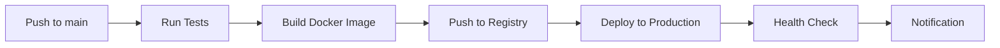

# Kubernetes Deployment Guide

This guide covers deploying the Udeaku CareSpring application to Kubernetes using GitHub Actions.

## Prerequisites

### Required Tools
- Kubernetes cluster (v1.28+)
- kubectl configured
- Docker registry access (GitHub Container Registry)
- Domain name for SSL certificates
- cert-manager for SSL automation

### Required Secrets
Create the following GitHub repository secrets:

#### GitHub Actions Secrets
```
KUBE_CONFIG_PRODUCTION      # Base64 encoded kubeconfig for production
KUBE_CONFIG_STAGING        # Base64 encoded kubeconfig for staging
SLACK_WEBHOOK_URL          # Slack webhook for notifications
SNYK_TOKEN                 # Snyk API token for security scanning
```

#### Kubernetes Secrets
```bash
# Create namespace
kubectl create namespace udeaku-carespring

# Create secrets (base64 encode your values)
echo -n 'your-google-maps-key' | base64
echo -n 'your-email-password' | base64
echo -n 'your-database-url' | base64
```

## Architecture Overview

```
┌─────────────────┐    ┌─────────────────┐    ┌─────────────────┐
│   GitHub Actions │───▶│ Docker Registry │───▶│ Kubernetes API  │
│                 │    │   (ghcr.io)     │    │                 │
└─────────────────┘    └─────────────────┘    └─────────────────┘
                                                        │
                                                        ▼
                                                ┌─────────────────┐
                                                │  Kubernetes     │
                                                │  Cluster        │
                                                │                 │
                                                │ ┌─────────────┐ │
                                                │ │ Deployment  │ │
                                                │ │ (3 pods)    │ │
                                                │ └─────────────┘ │
                                                │ ┌─────────────┐ │
                                                │ │   Service   │ │
                                                │ └─────────────┘ │
                                                │ ┌─────────────┐ │
                                                │ │   Ingress   │ │
                                                │ │ (HTTPS)     │ │
                                                │ └─────────────┘ │
                                                │ ┌─────────────┐ │
                                                │ │     HPA     │ │
                                                │ └─────────────┘ │
                                                └─────────────────┘
```

## Deployment Process

### 1. Automated Deployment Flow



### 2. Manual Deployment

#### Using kubectl directly:
```bash
# Apply all manifests
kubectl apply -f k8s/namespace.yaml
kubectl apply -f k8s/configmap.yaml
kubectl apply -f k8s/secret.yaml
kubectl apply -f k8s/deployment.yaml
kubectl apply -f k8s/service.yaml
kubectl apply -f k8s/ingress.yaml
kubectl apply -f k8s/hpa.yaml

# Check deployment status
kubectl get pods -n udeaku-carespring
kubectl get services -n udeaku-carespring
kubectl get ingress -n udeaku-carespring
```

#### Using Kustomize:
```bash
# Deploy with Kustomize
kubectl apply -k k8s/

# Check deployment
kubectl get pods -n udeaku-carespring
```

## Configuration

### Environment Variables

| Variable | Description | Default |
|----------|-------------|---------|
| NODE_ENV | Environment mode | production |
| PORT | Application port | 5001 |
| CONTACT_EMAIL | Contact email | carespringsup@gmail.com |
| WHATSAPP_NUMBER | WhatsApp contact | +2349033432591 |
| ALLOWED_ORIGINS | CORS allowed origins | udeaku-carespring.com |

### Resource Limits

| Resource | Request | Limit |
|----------|---------|-------|
| Memory | 256Mi | 512Mi |
| CPU | 250m | 500m |

### Auto-scaling

- **Min Replicas**: 3
- **Max Replicas**: 10
- **CPU Target**: 70%
- **Memory Target**: 80%

## Monitoring and Logging

### Health Checks
- **Liveness Probe**: `/health` endpoint every 10s
- **Readiness Probe**: `/health` endpoint every 5s
- **Startup Probe**: 30s initial delay

### Logs
```bash
# View pod logs
kubectl logs -f deployment/udeaku-carespring -n udeaku-carespring

# View logs from specific pod
kubectl logs -f <pod-name> -n udeaku-carespring
```

### Monitoring
```bash
# Check resource usage
kubectl top pods -n udeaku-carespring
kubectl top nodes

# Check HPA status
kubectl get hpa -n udeaku-carespring
```

## Security

### Container Security
- Non-root user (UID 1001)
- Read-only filesystem
- Minimal capabilities (all dropped)
- Security context enforced

### Network Security
- TLS termination at ingress
- Rate limiting (100 req/min)
- CORS configured
- Internal cluster communication only

### Secrets Management
- Kubernetes secrets for sensitive data
- GitHub secrets for CI/CD
- No hardcoded credentials

## Troubleshooting

### Common Issues

#### Pod not starting
```bash
# Check pod status
kubectl describe pod <pod-name> -n udeaku-carespring

# Check logs
kubectl logs <pod-name> -n udeaku-carespring
```

#### Service not accessible
```bash
# Check service endpoints
kubectl get endpoints -n udeaku-carespring

# Check service configuration
kubectl describe service udeaku-carespring-service -n udeaku-carespring
```

#### Ingress not working
```bash
# Check ingress status
kubectl describe ingress udeaku-carespring-ingress -n udeaku-carespring

# Check ingress controller logs
kubectl logs -n ingress-nginx
```

### Rollback

```bash
# Rollback to previous deployment
kubectl rollout undo deployment/udeaku-carespring -n udeaku-carespring

# Check rollback status
kubectl rollout status deployment/udeaku-carespring -n udeaku-carespring
```

## Maintenance

### Updates
```bash
# Update image
kubectl set image deployment/udeaku-carespring udeaku-carespring=ghcr.io/your-username/udeaku-carespring:v1.1.0 -n udeaku-carespring

# Restart deployment
kubectl rollout restart deployment/udeaku-carespring -n udeaku-carespring
```

### Scaling
```bash
# Manual scaling
kubectl scale deployment udeaku-carespring --replicas=5 -n udeaku-carespring

# Update HPA
kubectl patch hpa udeaku-carespring-hpa -n udeaku-carespring -p '{"spec":{"maxReplicas":15}}'
```

## Backup and Recovery

### Backup Configuration
```bash
# Export all configurations
kubectl get all -n udeaku-carespring -o yaml > backup.yaml

# Backup secrets
kubectl get secrets -n udeaku-carespring -o yaml > secrets-backup.yaml
```

### Recovery
```bash
# Restore from backup
kubectl apply -f backup.yaml
kubectl apply -f secrets-backup.yaml
```

## Performance Optimization

### Resource Tuning
- Monitor resource usage regularly
- Adjust limits based on actual consumption
- Use vertical pod autoscaler if needed

### Caching
- Implement Redis for session storage
- Use CDN for static assets
- Enable browser caching

### Database Optimization
- Use connection pooling
- Implement read replicas
- Regular maintenance and indexing

## Compliance

- GDPR compliant data handling
- Regular security scans
- Audit logging enabled
- Data encryption at rest and in transit
